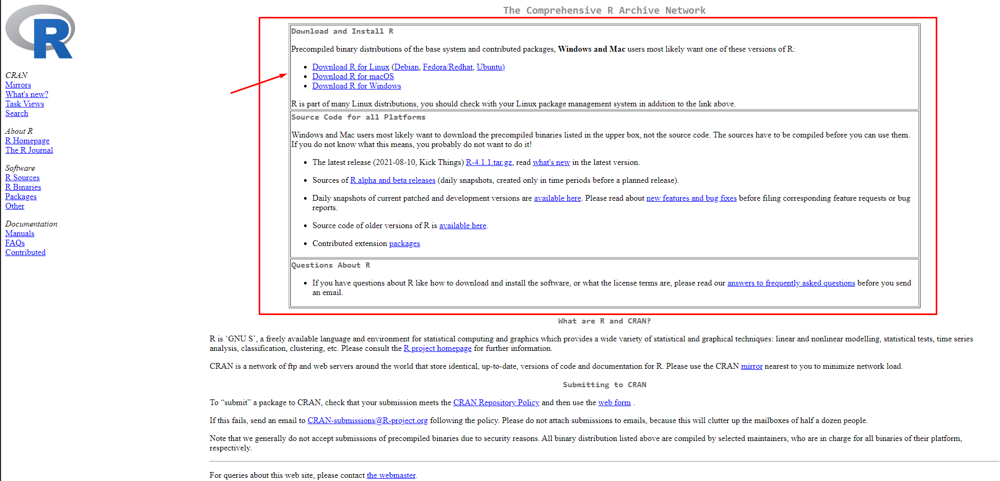
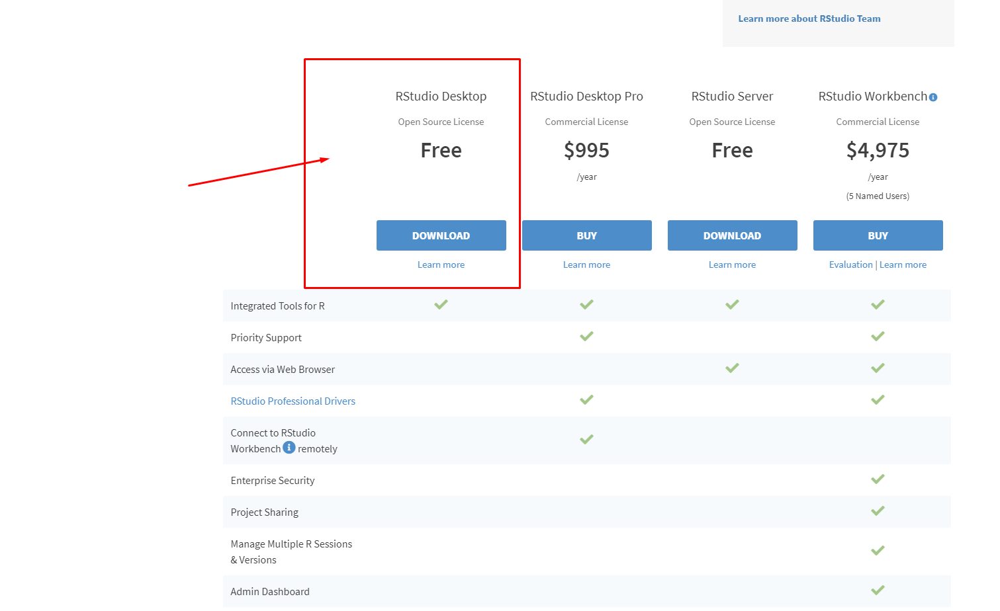
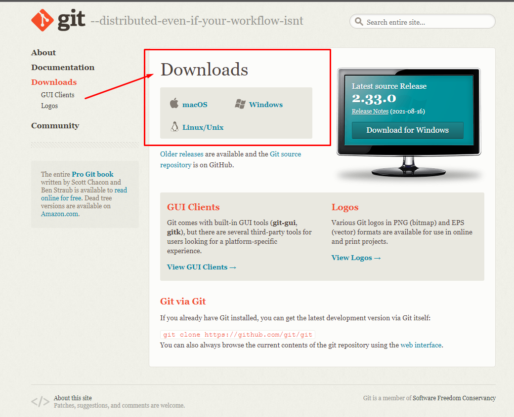
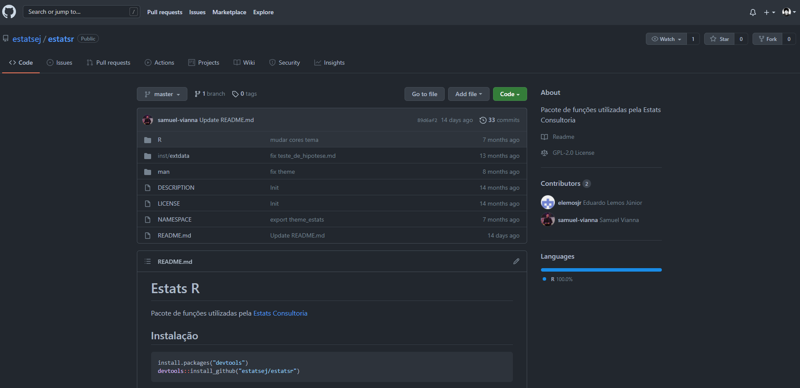
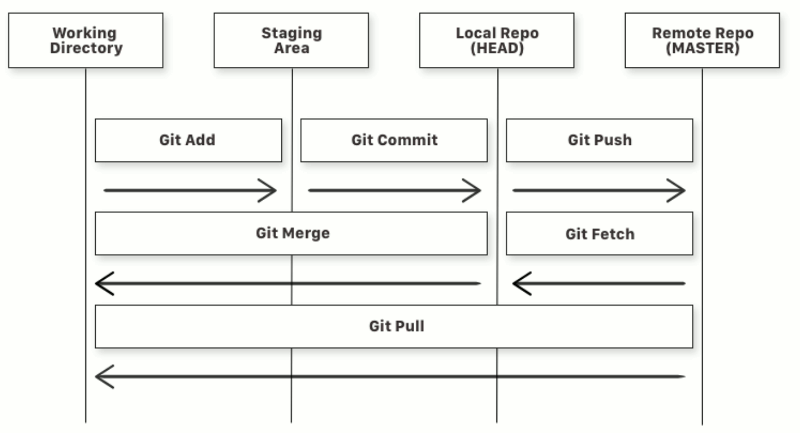

```{r xaringan-themer, include=FALSE, warning=FALSE}
library(xaringanthemer)
style_mono_accent(
  base_color = "#1c5253",
  header_font_google = google_font("Josefin Sans"),
  text_font_google   = google_font("Montserrat", "300", "300i"),
  code_font_google   = google_font("Fira Mono")
)
```

# Conteúdo

-  Pré-requisitos


-  Conceitos básicos importantes


-  Configurando o Git e Github

---

# Pré-requisitos

### R 

- [Download neste link](https://cran.r-project.org/)

---

# CRAN

```{r, out.width="100%", fig.align = 'center', echo=FALSE}

```
---

# Rstudio

- [Download neste link](https://www.rstudio.com/products/rstudio/download/)

---

# Imagem Rstudio

```{r, out.width="100%", fig.align = 'center', echo=FALSE}

```

---

# Git

- Download neste link

---

# Imagem Git

```{r, out.width="71%", fig.align = 'center', echo=FALSE}

```

---

# Github


- Criar uma conta no GitHub, [clique aqui](https://github.com/)


- Caso já tenha, apenas fazer o login.


---

# Conceitos básicos importantes

--- 

# O que é Git?

- Git é um **sistema de versionamento**, criado por Linus Torvalds em 2005. Linus é o autor do Linux.

- O Git é capaz de guardar o histórico de alterações de todos os arquivos dentro de uma pasta, essa pasta chamamos de repositório.

- É importante à medida que o trabalho é **colaborativo**.

- Resumindo, Git é um software que você instala no seu computador.
---

# O que é GitHub?

- GitHub é um site onde você coloca e compartilha os repositórios Git.

- Utilizado por milhões de pessoas em projetos de código aberto ou fechado.

- Existem alternativas, como [GitLab](https://gitlab.com) ou [BitBucket](https://bitbucket.com).

- Resumindo, GitHub é um site que você acessa na internet.

---

# GitHub

```{r, out.width="100%", fig.align = 'center', echo=FALSE}

```

---

# Algumas Observações

- O Git pode ser usado através:

  - **Linha de Comando (CLI):**
  
  - [git](https://github.com/estatsej/manual-github)
  
  - terminal do Rstudio
  
  - **Interfaces gráficas:**
 
  - [GitHub Desktop](https://desktop.github.com/)
 
  - Git Pane do Rstudio
 
  - Entre outras!
 
Utilize o que for mais confortável pra você! :)

---

# Configurando o Git

- Informar para o Git seu nome, e email.

- Utilize o mesmo email associado à sua conta do GitHub.

```{shell echo=TRUE}
git config user.name "SEU NOME"

git config user.email "SEU EMAIL"
```

- Para conferir se tudo deu certo, digitar no Terminal ou Prompt de Comando:
```{shell, echo=TRUE}
git status 
```
--- 

---

# Fluxo de trabalho 

O diagrama abaixo exemplifica o fluxo de trabalho de um projeto de versionamento.

```{r, out.width="80%", fig.align = 'center', echo=FALSE}

```
--- 